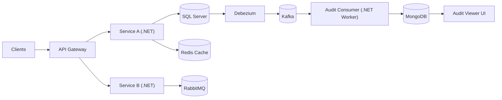

<!--
PROFILE README
Theme: Calm Systems, Sharp Edges
Goal: In 15 seconds, visitors understand what you build and how you think.
-->

<h1 align="center">Hi, I'm Bahadır 👋</h1>

  Backend Engineer focused on <b>boring-in-production</b> systems: secure, observable, and scalable.

  <a href="https://www.linkedin.com/in/bahadir-kayhan-31a55a1b2">LinkedIn</a> •
  <a href="mailto:kayhan1901@gmail.com">Email</a>

  <b>.NET</b> • <b>Microservices</b> • <b>API Gateway</b> • <b>Auth</b> • <b>Event-Driven</b> • <b>Kafka/Debezium</b> • <b>RabbitMQ</b> • <b>Redis</b> • <b>SQL Server + MongoDB</b> • <b>Production Reliability</b>

---

## ⚙️ What I work on
- **.NET backend engineering** with clean layering (API / Application / Domain / Infrastructure)
- **Microservices** with strong contracts, predictable behavior, and clear boundaries
- **API Gateway patterns** (routing, centralized auth, rate limiting, health checks)
- **Authentication & security** (JWT, refresh-token rotation, OTP-first flows)
- **Event-driven systems** (Kafka, Debezium CDC, RabbitMQ messaging, Redis caching)
- **Data foundations** (SQL Server, stored procedures, pragmatic ADO.NET mapping, MongoDB event stores)

---

## 🧠 Current obsessions
- **Reliability**: idempotency, retry strategies, safe failure modes
- **Auditability**: event timelines, traceable operations, clean event payloads
- **Maintainability**: consistent naming, small PRs, readable architecture decisions

---

## 🧩 Featured projects (pin these)
### 1) Audit Pipeline (CDC → Kafka → MongoDB)
**Why:** production-grade audit trail  
**Highlights:** Debezium connector, Kafka consumer worker, idempotent ingestion, timeline viewer

### 2) API Gateway (.NET)
**Why:** a single secure entry point  
**Highlights:** centralized JWT verification, token forwarding, rate limiting, health checks

### 3) Shared Data Provider (MongoDB)
**Why:** reusable foundation across services  
**Highlights:** cached client/db approach, named connections, DI-first design, optional health checks

> If a project is private, consider a public “showcase” repo with architecture diagrams, ADR notes, and sample payloads.

---

## 🗺️ Architecture snapshot

---

## 🧰 Toolbox
**Backend:** .NET, ASP.NET Core Web API, ADO.NET  
**Data:** SQL Server (SP-heavy), MongoDB (event/audit store)  
**Messaging & Streaming:** Kafka, Debezium, RabbitMQ  
**Caching:** Redis  
**Infra:** Docker, Compose, CI-friendly setups  
**Quality:** conventions, PR review discipline, clean contracts, documentation

---

## 📈 GitHub signals 

  

  

---

## 🤝 How I like to collaborate
- Clear contracts, small PRs, reviewable change sets
- Document decisions with short ADR-style notes: what, why, how
- Optimize for maintainability over cleverness

  <i>Make it work. Make it clear. Make it last.</i>

